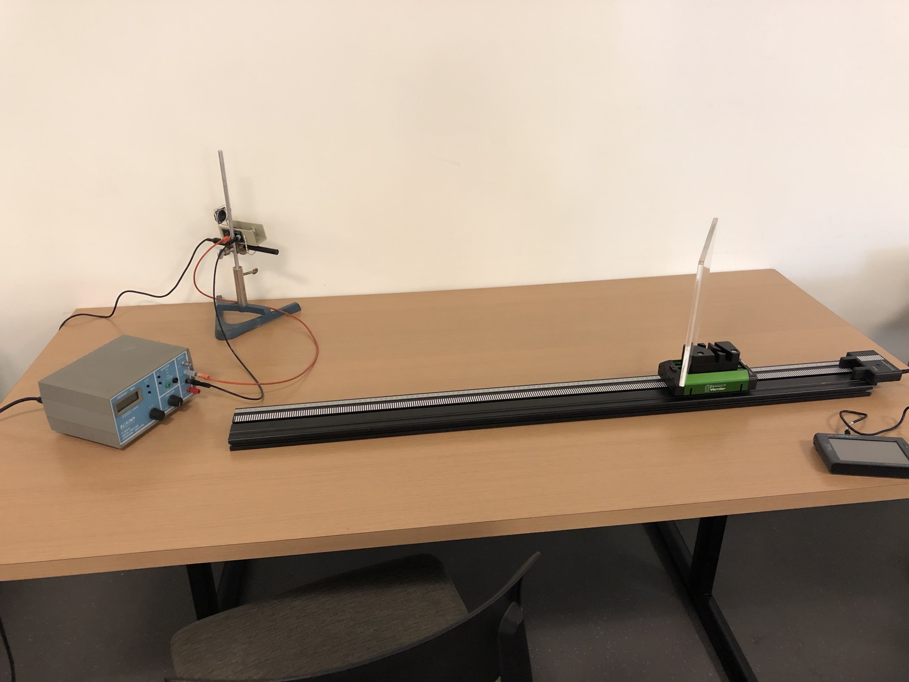

```{r setup, include=FALSE}
knitr::opts_chunk$set(echo = TRUE)
```


# Introduction

We present a novel activity to demonstrate the Doppler Shift of a sound wave incident, at an angle, upon a moving reflector.  This activity is intendend for use in an introductory physics laboratory focused on preparing students for the health and medical fields.  The activity is designed to simulate Doppler velocity measurments from ultrasound imaging.  

This activity has the following objectives.  First, to demonstrate to students how the Doppler shift can be used to determine the speed of an object in the specific cases of a stationary sound source and reciever and a moving reflecting surface.  Second, to demonstrate how this model can be built upon to accommodate an angled reflecting surface.

Laboratory activities appropriate for the first objective have been discussed in the literature already, see @gomez-tejedor_acoustic_2014, and references therin.  The second objective, however, is novel, and directly relates to real world applications in ultrasound imaging.


At non-relativistic speeds the change in frequency of a wave observed at a moving reciever from the initial frequency emitted at a moving source is given by

$$
f^{\prime} = \frac{c + v_{r}}{c + v_{s}} f_{0}.
$$

Where $f^{\prime}$ is the measured frequency, $c$ is the speed of sound, $v_{r}$ is the speed of the reciever, $v_{s}$ is the speed of the source, and $f_{0}$ is the emitted frequency.

To mimic measuring blood flow speed with ultrasound, we use an apparatus that contains a stationary initial sound source, a moving reflector, and a stationary receiver located near the initial source.  We can consider the the final frequency measured at the receiver to be the result of two Doppler shifts.  The first Doppler shift results from the moving receiver reflecting the intial sound pulse

$$
\begin{split}
f^{\prime} &= \frac{c + v_{r} }{c + v_{s} } f_{0} \\
 &= \frac{c + v_{r} }{c} f_{0}
\end{split}
$$

since $v_{s} = 0$.  The second Doppler shift results from the reflected wave now being "emitted" from the moving reflector with a frequency of $f^{\prime}$.  This reflected pulse will then be measured at the receiver with a frequency

$$
\begin{split}
f^{\prime \prime} &= \frac{c + v_{r^{\prime}}}{c + v_{s^{\prime}}} f^{\prime} \\
&= \frac{c + v_{r^{\prime}}}{c + v_{s^{\prime}}} \frac{c + v_{r}}{c} f_{0} \\
&= \frac{c}{c - v_{r}} \frac{c + v_{r}}{c} f_{0} \\
&= \frac{c + v_{r}}{c - v_{r}} f_{0} 
\end{split}
$$

since, $v_{s^{\prime}} = -v_{r}$.  

Now if the sound source and reciever is oriented at an angle $\theta$ with respect to the direction of motion of the reflectdor, then the apparent velocity of the cart along the line of sight of the sound pulse is $v_{r}^{\prime} = v_{r} \times cos \theta$. Thus the Doppler shifted frequency of the sound pulse becomes

$$
f^{\prime \prime} = \frac{c + v_{r} cos \theta}{c - v_{r} cos \theta} f_{0}. 
$$

### Apperatus

This activity makes use of commercially available equipment data aquisition software commonly used in introductory laboratories.  The equipment includes a motion encoding cart, receiver and track, with a custome made plastic reflector to attach to the cart.   The sound source is generated with a function generator and a speaker, and recieved with a microphone.  The LabQuest Mini and LabQuest 2, both devices from Vernier, and the Logger Pro software were used to aquire and log the data.


### Experiment 1

The first experiment is a measurement of the velocity of a cart using a Doppler shifted echo.  This is similar to experiments discussed already in the literature (ADD CITATIONS).  A cart with an attached reflector is set into constant velocity motion along a track.  A series of sound pulsed are emitted from a speaker at a known frequency, echo off the reflector attached to the moving cart, and are recorded by a microphone.  We use a frequency generator set to 20,000 Hz to generate the sound pulses.  This frequency is nice because it is outside the audible range of the lab instructor, although other frequencies may be used. Once the reflected pulse is recieved by the microphone, it is recorded and analysed using computer software.  Here, we use the commercially available Logger Pro software to perform this step.  The software processes the reflected signal with a Fourier Transform allowing the student to measure the frequency of the reflected pulse.  

In this setup we also independently measure the velocity of the cart.  To do this we used the commercially available Motion Encoder System from Vernier. This system includes a track with defined markings and a cart with an optical sensor to measure its velocity.  These measurement were visulaized using the LabQuest 2 interface by Vernier.  It should be noted, that to achieve constant velocity motion with the cart, we needed to set the track on a slight incline of a millimeter or so to counteract frictional slowing of the cart.  

Figure \ref{fig_approaching} shows the results of one trial of this experiment.  We can clearly see the emitted sound pulse a 20000 Hz as well as the reflected pulse near 20041 Hz.  The velocity of the cart is measured to be 0.36 m/s.  We can now calculate velocity of the cart using the Dopper shifted sound pulse.  

$$
\begin{split}
v &= c \times \frac{f^{\prime \prime}-f_{0}}{f^{\prime \prime}+f_{0}} \\
&= 340~m/s \times \frac{20041-20000}{20041+20000} \\
&= 0.35~m/s 
\end{split}
$$


University of Colorado [lab](https://www.colorado.edu/physics/phys1140/phys1140_sm98/Experiments/M6/M6.html) exercise using a sound source moving on a track.

This experiment can be simply modified to measure the velocity of a receding object.  


### Experiment 2



The second experiment builds off of the first and provides a novel activity particularly suited for health science students.  For this experiment the sound source, reciever and the reflector are all placed at an angle with respect to the direction of motion of the cart.  Figure \ref{fig_setup2} shows the setup for this experiment.  The cart that we use has a custom made maount that allows the reflector to be placed at angles of $5^{\circ}$, $15^{\circ}$, and $30^{\circ}$ with respect to the direction of motion.  

Figure \ref{fig_approaching_angle} shows the results of one trial with this setup.  In this case the reflector is set to an angle of $30^{\circ}$.  We can solve the Dopplar shift equation, accounting for the angle, to determine the velocity of the cart.

$$
\begin{split}
v &= \frac{c}{cos~\theta} \times \frac{f^{\prime \prime}-f_{0}}{f^{\prime \prime}+f_{0}} \\
&= \frac{340~m/s}{cos 30^\circ} \times \frac{20035-20000}{20035+20000} \\
&= 0.35~m/s 
\end{split}
$$


## Uncertainty in Experimental methods.  

* Consistant cart speed throughout experiment
  - means adjusting the level of the track
* How uncertain can the experiment be and still measure the effect of having the reflector 

Citation [@meltzer_resource_2012].

## TikZ picture
- Here is a TikZ picutre

\begin{tikzpicture}
\draw (0,0) circle (2cm);
\end{tikzpicture}


## Appendix

* LoggerPro profile

* LoggerPro/LabQuest2 Images
  - Mention the slope in the velocity graph as the cart slows down due to the track being level.
  
  REverse axis on LabQuest for 
